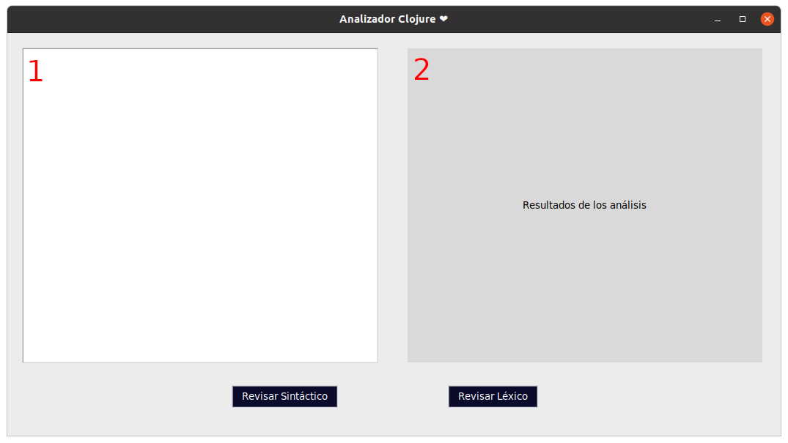

# Proyecto de LP - clojure

## Integrantes
- Josue Davalos
- Nicole Agila
- Sebastian Benalcazar

## Instalación de paquetes
Es necesario instalar los siguientes paquetes y/o dependencias, estas se encuentran en el archivo requiments.txt. Para instalarlas ejecutar el siguiente comando:

```
pip install -r requiments.txt
```
## Ejectuar test con archivos
```
python .\main.py test name_file
```
Existe 4 archivos de testing, estos son:
- josue.txt
- sebas.txt
- nico.txt
- sentencias.txt

## Probar con GUI
```
python main.py
```


En la sección numero 1 se debe ingresar el código en Clojure a validar, dando click en cualquiera de los botones mostrara en la sección numero 2 el análisis ya sea léxico o sintáctico.

- Si es válido se mostrará:
  - Léxico: Todos los tokens que son validos.
  - Sintáctico: Ok.

- Si no es válido:
  - Léxico: Los tokens que no reconoce el analizador.
  - Sintáctivo: Error.
